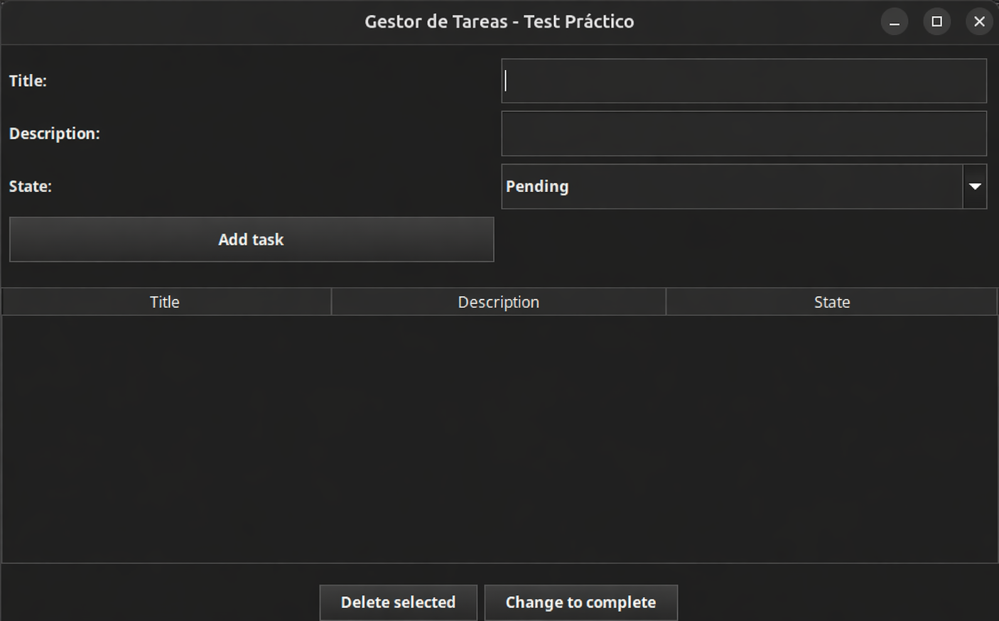
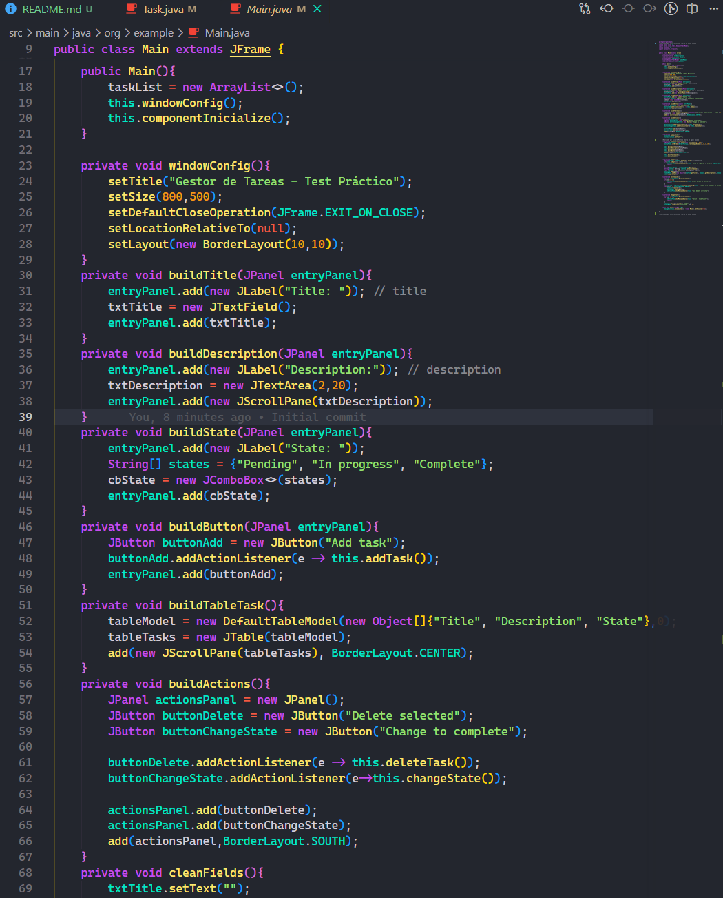

# Gestión de tareas

### 1. Descripción

Ejercio para gestionar las tareas


----------------------------------
### 2. Ejecutar proyecto

- Tener instalado JDK versión 25
- Clonar el proyecto
- Abra el proyecto en su IDE
- Ingresa a la carpeta out/artifacts/ManageTask_jar 

**Ejecutar:**
```
 java -jar ManageTask.jar
```

----------------------------------
### 3. Peticiones o acciones pedidas en la actividad

- Crear una tarea con (titulo, descripción y estado)
- visualizar las tareas creadas en una tabla con (titulo, descripción y estado)
- Eliminar tarea seleccionada.
- Cambiar el estado de la tarea seleccionada a completada.
- Seleccionar estado entre (pendiente, En progreso y completado)
- Validaciones

----------------------------------

### 4. esta es la estructura o forma que se utilizo

- Task: Modelo/clase con propiedades (title,description, state) con cuatro métodos (getTitle,getDescription, getState, setState).
- Main: Clase principal para iniciar el proyecto a partir de sus métodos internos.

### Muestra de como se ve y parte de codigo:







## Autor
Richard Montoya Betancur
Actividad práctica en Java Swing.